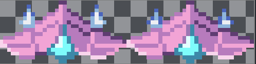

# Entry 3
##### 2/3/26

I am back once again with another blog entry about my Freedom project. In this entry, I will talk about what I accomplished so far as of my Winter Break plan and the three days I worked on my Godot Game Project. From adding small ships next to my main ship to making the top ship still, these are the days that I've worked on my Freedom Project for Senior Year.

## Day 7 - 12/30/25
This day was known as the last tinkering day of 2025 and I decided to make some progress like I said I would in my last entry. What I wanted to do was create two more sprites that move next to the main sprite. This wasn't my first idea because I wanted to initially duplicate that pink ship sprite, but the problem was when putting in values in the `Vector()` method, it wasn't working. So, I looked up how to duplicate my sprite on Google and it turns out I didn't need to change anything in the script. I just added two sprite 2d nodes as children of the 2d Character Body node. To add the ship sprites next to each other I went to the texture section on the right side of Godot's interface to look for the small ship sprite  Now you see what's circled right here and it's the position section. I tinkered with this and put 30 and -30px on both x-values to put the ships next to the main pink ship. When I ran this code, I noticed the ships were upside down, so I changed the rotation to 180. The y-value was only adjusted to match the y-value of the main ship.

## Day 8 - 1/12/26
It's the new year and what I decide to do for it, is add another ship at the top to represent my enemy to shoot at. It's been decided that the top ship sprite would be the same as the one on the bottom, but it would be a different color. How did I do that? I added another `Sprite2D` node in there. The reason I used the same ship as the bottom one is because the other ships were too small. I took the frame from my `AnimatedSprite2D` node because I didn't know how to separate the ship next to the same ship on the png below.  Now that I've run my code, I noticed the ship at the bottom was upside down. To fix this I had to change the rotation value on the right side to 180 degrees. The right side is where I change the position and rotation values. Now with all that, I wasn't able to change the color of the ship on this day, which meant I will have to wait for the next blog entry.

## Day 9 - 2/2/26
It's February and for this day, I noticed that when I ran the code, the ship on top was moving with the ships on the bottom that the player was controlling.I clearly don't want that. Before I fixed this, I tried figuring out how to change colors on the ship sprite up top. Using the RGB gradients on the right side wasn't working. Watching a video about [how to change colored sprites](https://www.youtube.com/watch?v=EKGhfneG2sw) wasn't working because the only nodes the guy used in the video aren't relevant to my current situation. They use the `ColorSprite` node instead of the `Sprite2D` nodes. Now to make the top ship stop moving when I press controls I enabled the `top-level` section on the right side. When I looked up top-level it told me that top level ignores the parent's transformations, like positioning and rotations, so it only uses all that stuff when used in its own local script. The right side was known as the Inspector section all along. I created a script in the node that the Top ship acquires and put this in.
```java
extends Sprite2D

func _ready():
   # Set the global position when the scene loads.
   global_position = Vector2(555, 100)
```
This is to set the position of the top ship in a local script in its respective area because when I last ran this code, the ship was nowhere to be seen after enabling Top Level. The ship was tiny when the code was run, so I changed the scale on the Inspector section from (1, 1) to (2, 2). With this code and changes, my scene runs perfectly with the ship staying still on top.
<hr>

And that is all the days that I spent on tinkering my Godot tool. I gotta say, I've done really good progress in accomplishing my Winter Break goal. However, I said I'd add five ships next to the main ship in [my previous entry](entry02.md). That was way too much ships, so I stuck with 2 on each side. I think I meant to say I would have five total ships. Now only one half of this goal was accomplished during Winter Break. The rest was before the assigned Blog Entry.

## EDP
Now it's time to talk about the path on my EDP (Engineering Design Process) So, when I tinkered with Godot on these three days, they all fit in with my goal from Winter Break last entry. That entry was when I was in the **Planning** part of the process. Now that I've done that goal, I advance to the next step which is **Creating** the prototype, but I was already creating this Godot project, the first time I used it. I also feel that the step after Creating was already done by running the code over and over for mistakes because technically, that's how you test code.

## Skills
**Problem Decomposition:** So, problem decomposition was a new skill that I acquired and it was because I tried to think of a solution for one problem, but then looked at another problem and broke that problem down into smaller pieces where each of those pieces would be in different days. The big task was my Freedom Project goal from Winter Break, where I broke that task in days. So I did the task of adding small ships next to the main ship on Day 7 and then added the ship sprite on top to represent the target the player's trying to shoot on Day 8.

**Embracing Failure UPDATE:** This skill has been improved in terms of I've been trying to change codes in the script of certain nodes like the Top Ship node to stay static and not move with the bottom ships that the player controls. It just turns out that I was supposed to enable top-level and change the `Vector()` value all along.

**How To Google UPDATE:** The only reason I was able to embrace and resolve my failure from before is by doing google searches once again. I did one Google Search on how to change a sprite's color, but it didn't give me any helpful tools. Maybe I should specify what the node is on Google that I want to change colors on. I then did another Google Search on how to keep the ship static and not move with the player, and it told me about the Top-level functionality in Godot where if it's enabled it ignores any movement from the parent as the sprite is the child of the parent node.

## Sources
[Blog Entry 1](entry01.md)

[Blog Entry 2](entry02.md)

[How to change Colored Sprites](https://www.youtube.com/watch?v=EKGhfneG2sw)

[Screenshots](../screenshots)


[Previous](entry02.md) | [Next](entry04.md)

[Home](../README.md)


