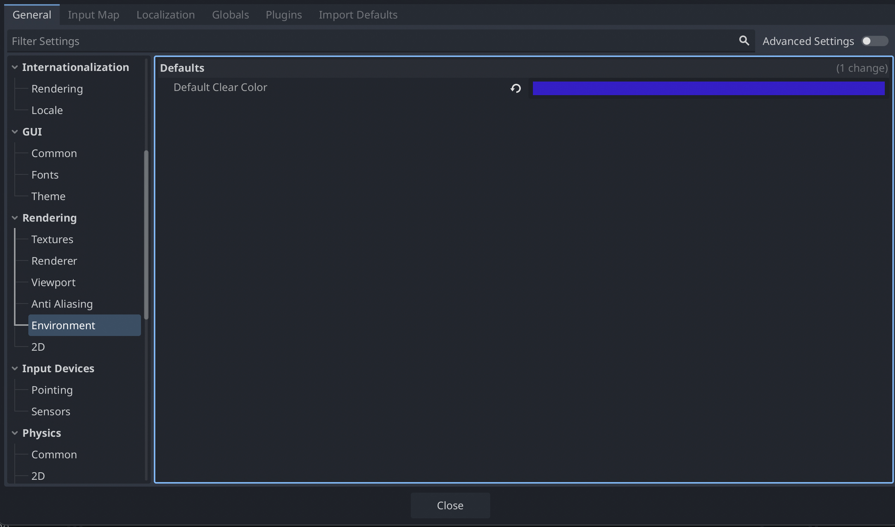
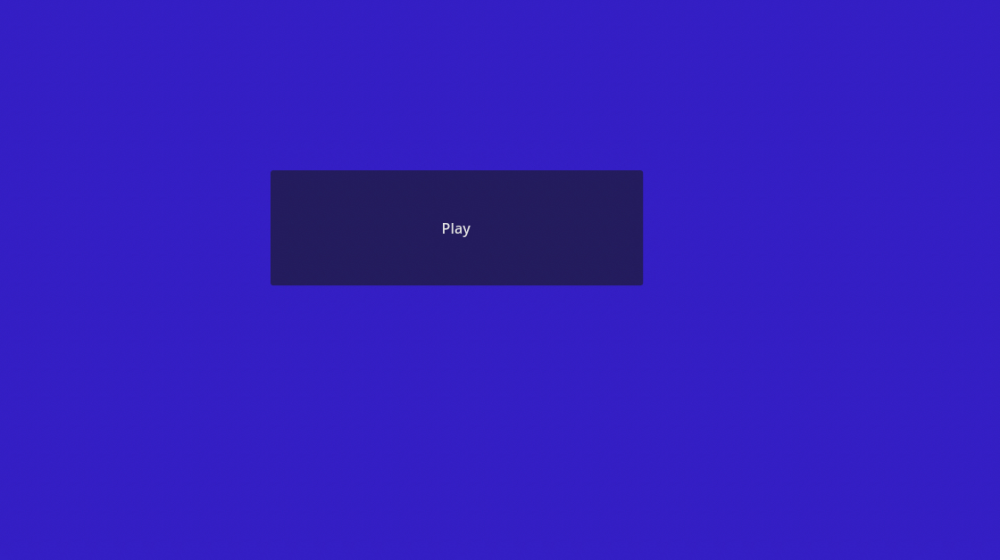
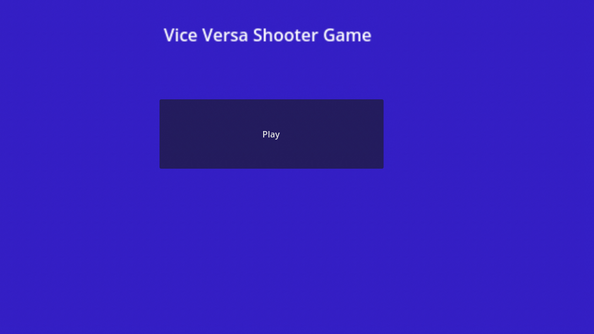

# Entry 6
##### 4/27/26

Alrighty, It is time for the next entry where I talk about the steps that I took to make my Beyond MVP. As you know, I already finsihed all my tasks fro the MVP, so now I'm going to be working beyond MVP starting today.

## How I started it
This how I started setting up my Beyond MVP list which can be seen on my [plan](../prep/plan.md). In class, we had a period where we walked to other people's projects at their MVP and we would try them and give them grows or glows. When I was given this type of feedback I mostly got grows about how I should add a health bar to the players or add more enemies. I'm only putting adding a health bar to my plan because the point of my project is to be a vice versa 2d shooter where only one top ship is placed into action to shoot. With that, my Beyond MVP list looks like this now:
- [ ] Make visual changes to the menu
- [ ] Make visual changes to the gameplay
  - [ ] Have the ships flash red when hit
- [ ] Add health bar for ships
- [ ] Add timer

Now let's get to the first day of working Beyond MVP.

## Day 1 of Beyond MVP - 4/27/2026
So what I did was make vsual changes to the menu by changing the positioning of the play button. It was initially on the top and now with Inspector, it's at the center by using the Transform Tab and changing the position of the y-value.

Now I also changed the background to a different color like blue to make the play screen look more unique by going to project settings and seeing this. Because of this, my Play screen now looks like this.  This means I can check off the visual changes made to the menu. Psyche! I have to add the label for people to know the game that they will play once hitting the play button. This is an example of me using Consideration. So, I added a label node to my main scene and put in the text "Vice Versa Shooter Game". Then, I went into Inspector, set the Horizontal Align to center and changed the scale until the title was purely visible. Now it finally looks like this.  Now, I can check this off my plan.

[Previous](entry05.md) | [Next](entry07.md)

[Home](../README.md)
