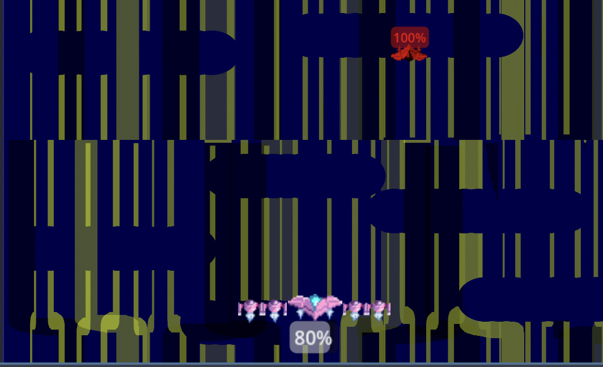
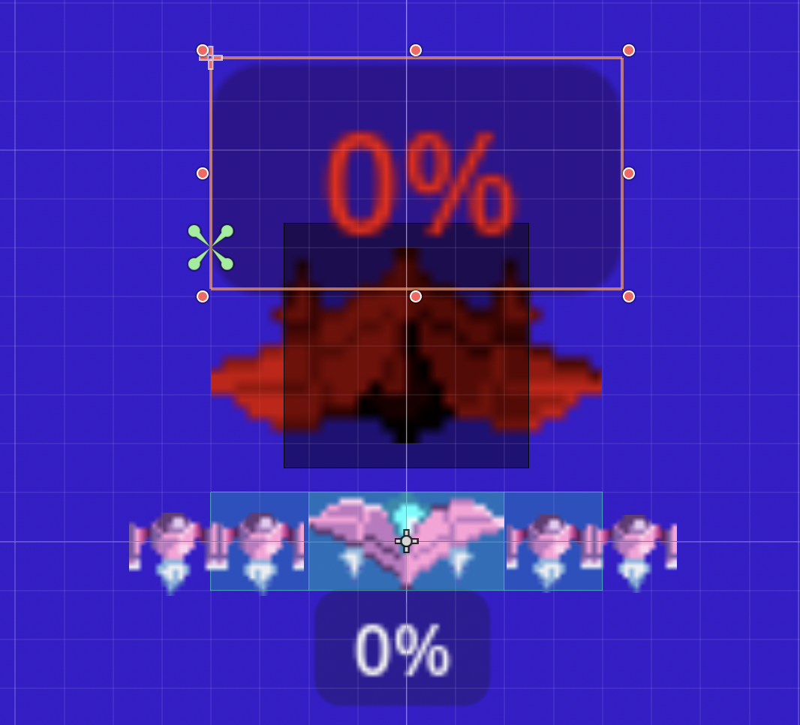

# Entry 6
##### 4/27/26

Alrighty, It is time for the next entry where I talk about the steps that I took to make my Beyond MVP. As you know, I already finsihed all my tasks fro the MVP, so now I'm going to be working beyond MVP starting today.

## How I started it
This how I started setting up my Beyond MVP list which can be seen on my [plan](../prep/plan.md). In class, we had a period where we walked to other people's projects at their MVP and we would try them and give them grows or glows. When I was given this type of feedback I mostly got grows about how I should add a health bar to the players or add more enemies. I'm only putting adding a health bar to my plan because the point of my project is to be a vice versa 2d shooter where only one top ship is placed into action to shoot. With that, my Beyond MVP list looks like this now:
- [ ] Make visual changes to the menu
- [ ] Make visual changes to the gameplay
  - [ ] Have the ships flash red when hit
- [ ] Add health bar for ships
- [ ] Add timer

Now let's get to the first day of working Beyond MVP.

## Day 1 of Beyond MVP - 4/27/2026
So what I did was make vsual changes to the menu by changing the positioning of the play button. It was initially on the top and now with Inspector, it's at the center by using the Transform Tab and changing the position of the y-value.

Now I also changed the background to a different color like blue to make the play screen look more unique by going to project settings and seeing this. Because of this, my Play screen now looks like this.  This means I can check off the visual changes made to the menu. Psyche! I have to add the label for people to know the game that they will play once hitting the play button. This is an example of me using Consideration. So, I added a label node to my main scene and put in the text "Vice Versa Shooter Game". Then, I went into Inspector, set the Horizontal Align to center and changed the scale until the title was purely visible. Now it finally looks like this.  Now, I can check this off my plan.

## Day 2 of Beyond MVP - 4/28/2026
Now it's the next day and I decided to try and have the ships flash red when hit. Of course I won't know how to do that myself, so I used Google. Now I did know that I have to update the `take_damage` function in the ship's scripts. Google showed me this thing called a "tween" that changes the color quickly before turning back to normal. I created a variable called the tween and used the `create_tween` method.
```java
var tween = create_tween()
tween.tween_property($Sprite2D, "modulate", Color.RED, 0.05)
```
The other line of code you use is what's responsible for turning the top ship red when hit by the player's pellet. There's also that same line of code where it changes to normal.
```java
tween.tween_property($Sprite2D, "modulate", Color.WHITE, 0.1)
```
Google left a note telling me to replace Sprite2D with the name of my ship's Sprite node. I musunderstood this and put "top_ship". This was asking for the location. After some tweaking, this is what I ended up with.
```java
func take_damage(amount: int):
	health -= amount
	var tween = create_tween()
	tween.tween_property($".", "modulate", Color.RED, 0.05)
	tween.tween_property($".", "modulate", Color.WHITE, 0.1)

	if health <= 0:
		top_died.emit()
		// You can add an explosion effect here later
		queue_free() // This removes the ship from the scene
```
Now when this was put into play, the top ship flashed to normal, so I chanegd the Self modulation color in the inspector tab and gave the appropriate color. Now I've played with this code and noticed it's a little hard to actually win when I put my top ship's health at 20. So, I increased the pellet speed for my player's ship to 1,000.

## Day 3 of Beyond MVP - 4/29/2026
Alright, it's the next day of Beyond MVP and I decided to go throguh what the people have been saying as the grows: Adding a health bar. This requires the use of Googling and it introduced me to the ProgressBar node which shows the percentage of health the player has, so I added this to the chld node along with importing a variable to represent that.
```java
@onready var p_health_bar: ProgressBar = $PlayerShip/pHealthBar
```
I also changed the max value on the inspector side to the amount of health that the player ship has. This is the code I used to set up my health
```java
	if p_health_bar:
		p_health_bar.value = health
```
This was in the `take_damage` function. The next code is in the `_ready` function
```java
	p_health_bar.max_value = health
	p_health_bar.value = health
```
I was almost done, but when running the code, I realized the health bar's upside down, so I went to the 2D section on the top of Godot and rotated the bar. What I also did was change the collision shape to hit all ships and make the other two ships next to the player smaller. Now that the player ships health bar was done, the same would happen for the top ship. Now that that's done I did some changes to the percentage bars and now my screen now looks like this.  In addition, I'll show you how the 2D set of that looks in the Player scene. 

## Presentation
Now that my Beyond MVP tasks were finished I had the presejntation and the elevator expo left to talk about in this entry, which means this is the last entry of APCSA and it's the end of all my Freedom Project entries that I've done since Sophomore year. In the sources or [this link](../prep/presentation.md), you'll see that I set up my plans for what I'll include in my presentation.

- Since my project is a vice versa 2D Shooter, I decided that my hook would be to ask the audience whi likes Galaga and explain how it works, so some people know what Galaga is.

- Then for my product I introduced my Vice Versa 2D shooter game via url preview by having that link in the screenshot that I put in my [presentation slides](https://docs.google.com/presentation/d/1L1pmkytvkNs3h4wF66MrrdmPFS5RxBlWtAFI9ewUmqo/edit?slide=id.g3db6786bad8_0_496#slide=id.g3db6786bad8_0_496).

- Next is the Process and I decided to show my plans from MVP & Beyond MVP, code snippets of the pellets and the ship's scripts, and I explained the challenhe of making the Game over screens because there was this day that it took me forever to trey and code the ships to disappear when enough damage from the pellets have been dealt.

- Finally for my conclusion, I put in the url to my preview because I don't know how to make the Godot file accessible to public and I added two takeaways for this project
	1. Learn from the feedback you get from testers.
	2. There's always room for improvement.

I put a skill from the [hstatsep website](https://hstatsep.github.io/students/) about consideration, which is a skill I acquired and will take about later.

But yeah, that's it for the presentation part. Now let's talk about the Expo elevator pitch.

## EDP

## Skills

## Sources
[My MVP Plan](../prep/plan.md)

[My Presentation Plan](../prep/presentation.md)

[My Presentation Slides](https://docs.google.com/presentation/d/1L1pmkytvkNs3h4wF66MrrdmPFS5RxBlWtAFI9ewUmqo/edit?slide=id.g3db6786bad8_0_496#slide=id.g3db6786bad8_0_496)

[HSTAT SEP Site](https://hstatsep.github.io/students/)

[Blog Entry 1](entry01.md)

[Blog Entry 2](entry02.md)

[Blog Entry 3](entry03.md)

[Blog Entry 4](entry04.md)

[Blog Entry 5](entry05.md)

[My Godot Repository](https://github.com/alvinf7989/2d-vice-versa-shooter-alvin)

[Screenshots](../screenshots)


[Previous](entry05.md) | [Next](entry07.md)

[Home](../README.md)
