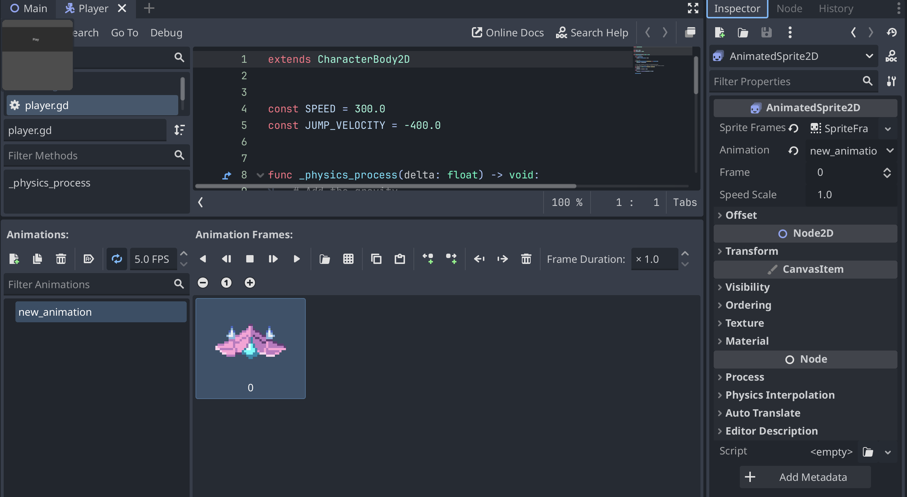

# Tool Learning Log

## Tool: **Godot**

## Project: **A 2d Shooting Game**

---

### Day 1 - 9/29/2025:
* So, starting this day was when I decided on using the tool Godot. However, I didn't know much about this app, so I watched this [Crash Course](https://www.youtube.com/watch?v=S8lMTwSRoRg) on YouTube and it teaches me how to get started on it. So far I followed its steps by creating a button and setting a 2d Scene for my project. When I first tried to add text, it didn't seem to pop up on the black button. I didn't know what was wrong, but it turns out that the text was too small from the 2d scene.

### Day 2 - 10/27/2025:
It has almost been a month since I updated my learning log. Anyways, I watched more of that [Crash Course](https://www.youtube.com/watch?v=S8lMTwSRoRg) on YouTube, and I learned some new functions like giving my play button the ability to change scenes after it has been clicked. Here's the code that was put in the script:
```js
func _on_play_pressed() -> void:
	get_tree().change_scene_to_file("res://shooter_area.tscn")
```
In the function, it will determine that when the play button is pressed, the 2nd line of code will run where it changes the scene to the file where the link to that scene is in parenthesis. Afterwards, I put in a label like the guy in the video did on the shooter area scene where it says, "This is the label."

### Day 3 - 11/7/2025:
It's the next day, and I have decided to try and create a background to put in my shooting area. I went back to photoshop like my previous freedom project and created a background that would scroll once the user hits the play button. This meant that I had to remove the label and export my background as a png to drag into my Godot project. Now, I watched the crash course video once again and he had his background scrol horizontally, while I had mines move vertically. Here was my code:
```js
extends ParallaxBackground

var scrolling_speed = 100

func _process(delta):
	scroll_offset.y += scrolling_speed * delta
```
The mathematical operator for the `scroll_offset` part of this code is to change direction depending on the axis the background is scrolling on. For my code, I chose to have the background scroll downwards by setting the offset to y instead of x like in the video. If it was `-=`, the background would scroll up. Now before this, I had issues with how to get this to work, like how I have to change the script line where it says `extends` to Parallax Background.

After that has been finished, I had to adjust the mirroring for the y-value of the background, so it could repeatidely scroll infinite backgrounds. Without this, the background would just move downwards leaving the screen.

### Day 4 - 11/18/25
On the 4th day, I learned how to add my ship sprite to my background. I watched more of that Godot Crash Course and added my ship sprite from the spaceship shooter gamekit pack that I just downloaded. So, what I did was add a new node which was called `CharacterBody2D` in a separate scene, attached a separwate script to that scene, and I added a capsule collision shape node, so we know where the ship sprite's hitbox is. How I even got the sprites from the pack to pop up in the Godot project was through dragging and dropping.

Now I could only find a sprite sheet of the ship, so when making sprite frames, I selected one frame to be the ship by setting the horizontal to 2 and the vertical to zero, and simply selected one.  Seen on the image below shows the script being made by attaching a node script to the player sprite. I chose a default "CharacterBody2D: Basic Movement" template to have the script that's shown. Now witth the entire script attached, once the user presses play from the starting scene. the ship sprite appears on the top left corner as tiny and then falls off screen.
```js
if not is_on_floor():
		velocity += get_gravity() * delta
```
This function is the reason for why it falls off screen because there is no ground or floor or anything for the sprite to collide on. This code itself adds gravity according to the comments of the template.

<!--
* Links you used today (websites, videos, etc)
* Things you tried, progress you made, etc
* Challenges, a-ha moments, etc
* Questions you still have
* What you're going to try next
-->
