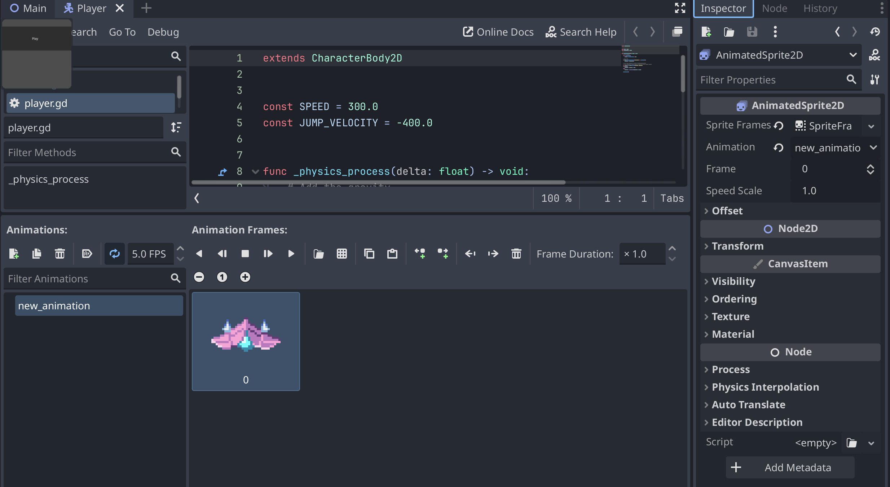
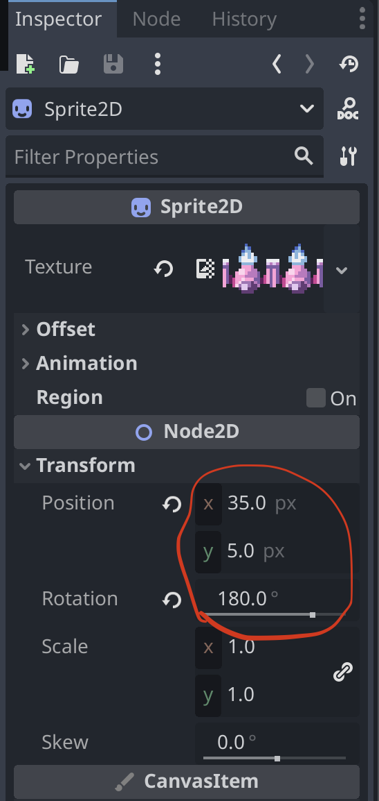
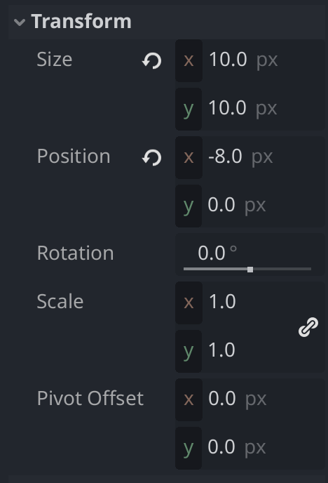
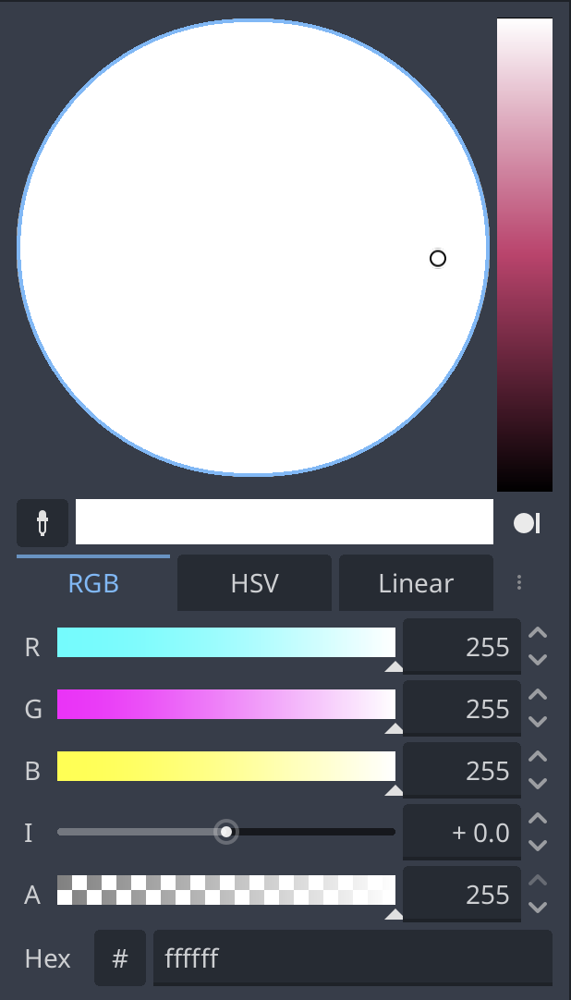
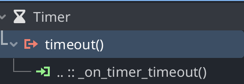
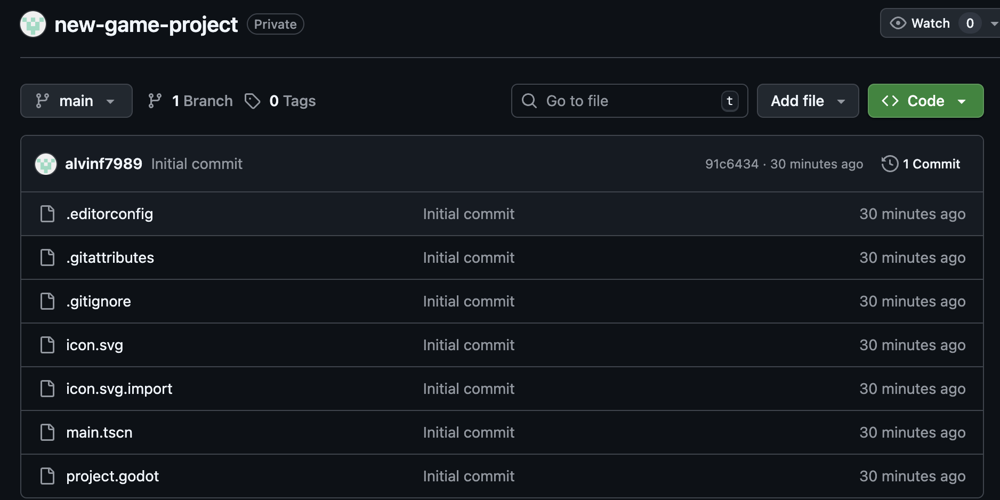
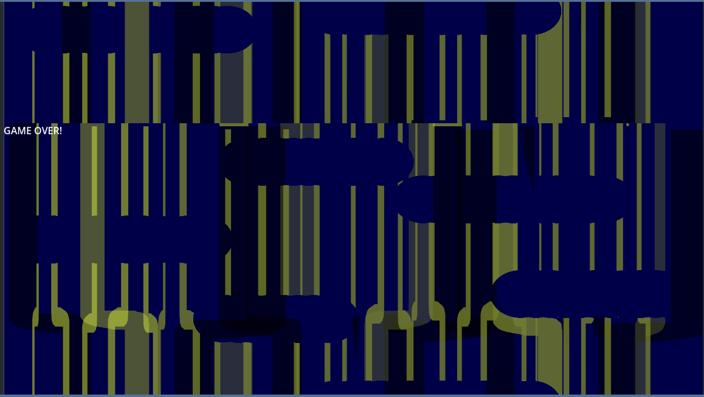

# Tool Learning Log

## Tool: **Godot**

## Project: **A 2d Shooting Game**

---

### Day 1 - 9/29/2025:
* So, starting this day was when I decided on using the tool Godot. However, I didn't know much about this app, so I watched this [Crash Course](https://www.youtube.com/watch?v=S8lMTwSRoRg) on YouTube and it teaches me how to get started on it. So far I followed its steps by creating a button and setting a 2d Scene for my project. When I first tried to add text, it didn't seem to pop up on the black button. I didn't know what was wrong, but it turns out that the text was too small from the 2d scene.

### Day 2 - 10/27/2025:
It has almost been a month since I updated my learning log. Anyways, I watched more of that [Crash Course](https://www.youtube.com/watch?v=S8lMTwSRoRg) on YouTube, and I learned some new functions like giving my play button the ability to change scenes after it has been clicked. Here's the code that was put in the script:
```js
func _on_play_pressed() -> void:
	get_tree().change_scene_to_file("res://shooter_area.tscn")
```
In the function, it will determine that when the play button is pressed, the 2nd line of code will run where it changes the scene to the file where the link to that scene is in parenthesis. Afterwards, I put in a label like the guy in the video did on the shooter area scene where it says, "This is the label."

### Day 3 - 11/7/2025:
It's the next day, and I have decided to try and create a background to put in my shooting area. I went back to photoshop like my previous freedom project and created a background that would scroll once the user hits the play button. This meant that I had to remove the label and export my background as a png to drag into my Godot project. Now, I watched the crash course video once again and he had his background scrol horizontally, while I had mines move vertically. Here was my code:
```js
extends ParallaxBackground

var scrolling_speed = 100

func _process(delta):
	scroll_offset.y += scrolling_speed * delta
```
The mathematical operator for the `scroll_offset` part of this code is to change direction depending on the axis the background is scrolling on. For my code, I chose to have the background scroll downwards by setting the offset to y instead of x like in the video. If it was `-=`, the background would scroll up. Now before this, I had issues with how to get this to work, like how I have to change the script line where it says `extends` to Parallax Background.

After that has been finished, I had to adjust the mirroring for the y-value of the background, so it could repeatidely scroll infinite backgrounds. Without this, the background would just move downwards leaving the screen.

### Day 4 - 11/18/25
On the 4th day, I learned how to add my ship sprite to my background. I watched more of that Godot Crash Course and added my ship sprite from the spaceship shooter gamekit pack that I just downloaded. So, what I did was add a new node which was called `CharacterBody2D` in a separate scene, attached a separate script to that scene, and I added a capsule collision shape node, so we know where the ship sprite's hitbox is. How I even got the sprites from the pack to pop up in the Godot project was through dragging and dropping.

Now I could only find a sprite sheet of the ship, so when making sprite frames, I selected one frame to be the ship by setting the horizontal to 2 and the vertical to zero, and simply selected one.  Seen on the image below shows the script being made by attaching a node script to the player sprite. I chose a default "CharacterBody2D: Basic Movement" template to have the script that's shown. Now witth the entire script attached, once the user presses play from the starting scene. the ship sprite appears on the top left corner as tiny and then falls off screen.
```js
if not is_on_floor():
		velocity += get_gravity() * delta
```
This function is the reason for why it falls off screen because there is no ground or floor or anything for the sprite to collide on. This code itself adds gravity according to the comments of the template.

### Day 5 - 12/3/25
So, it's the next day, and where I left off, whenevr I ran the game, my sprite fell off screen from the top left. So, what I did was google how to change script to try and change that, so I deleted the previous script, thinking I would have to find a new template, but I didn't. So, I googled on how to make my sprite not fall off and only move left to right, and it gave me this code
```js
extends CharacterBody2D

@export var speed = 400

func _physics_process(delta):
    # Get input for the horizontal axis
    var direction_x = Input.get_axis("ui_left", "ui_right")

    # Set velocity only for the x-axis
    velocity.x = direction_x * speed
    velocity.y = 0 # Ensure no vertical movement

    # Apply movement
    move_and_slide()
```
So, I copied this, and don't worry, I see the comments that tell me what these functions do. Now when running the code, the spite successfully stays and moves left and right, the only issue is it's on the position, I don't want it to be. So, I googled once again on how to change position of the sprite and it said that I got to put in this code
```java
func _ready():
    # Set the sprite's position to (200, 150)
    position = Vector2(200, 150)
```
What this does is set the sprite's position at xertain axes by setting the position to the vector with x and y values in the parenthesis. The initial values seen on the code above have my spaceship on top, usually where the enemy is located, so I changed both values to 550, to finally put the sprite in the position like normal 2d shooter games do.

### Day 6 - 12/8/25
It's the next day, and I decided to change the size of my ship sprite. I looked up on Google how to change size of a 2d sprite and I tried putting in this code:
```js
$player.scale = Vector2(0.5, 0.5)
```
I thought this would work, but when I ran the code, it gave me an error after I pressed start. So I watched another Youtube video on [How To Scale a 2D Object in Godot](https://www.youtube.com/watch?v=hWAy7ajhg2c) and it turns out I just had to use this code:
```js
scale.x = 10
scale.y = 10
```
When I tried 10 for these values, the ship sprite was too big for me, so I tested 5, and then finally 3 to get my ship sprite at just the right sides.

### Day 7 - 12/30/25
I am back on December and felt like I should do one last tool tinkering day of the year before 2026. I was starting on duplicating the sprites first but when I tried this on the script it was really confusing and any number I put in the `Vetcor2()` value wasn't working, so I decided to add the small ship sprites and with a Googling trick, I was able to figure out that I don't need to use the script to make changes on the positioning I just created two sprite 2d nodes as children of the 2dCharcaterBody and to add the sprites I went to the texture part in the right side and looked for the small ship sprites.  Now I can't change how big this screenshot is, but if you look at the position section you'll see I put 30 px as the values to turn my sprite to the right, -30 to go to the left. I also change the angle to 180 because they seemed upside down when I ran the code. Finally, I adjusted the y-value to go a little more down enough to make them fit with the main player sprite. So far, I'm meeting half of my Winter Break goal.

### Day 8 - 1/12/26
Welcome to the first learning log day of 2026, previously I added 2 small ship sprites on each side of the main ship sprites. What I wanted to do was add another ship sprite at the top as part of my goal from one of my blog entries. The ship sprite would be the same as the main sprite at the bottom but it would be a different color. So, I added another Sprite2D node to represent the top ship, then since the other ships were too small, I decided to add my previous ship that I've used before. Of course there's two of them, and since I don't know how to make it one sprite, I had to improvise and take the frame from my AnimatedSprite2D node. I also noticed my orginal ship sprite was upside down so I changed the rotation value of that sprite to 180 degrees to flip it. Unfortunately, while I did good on putting the ship sprite up top, the color still remains the same and I'm trying to change it.

### Day 9 - 2/2/26
Another day, another Godot review. So, I left off on trying to figure out how to change the code, but then went to a different step which is making the top ship still even when I'm moving my bottom ships, because right now, it's moving with my ships in sync. I don't want that, so I tried creating a script and googling solutions. Yes, I used Google again. I tried many scripts, but nothing worked. I then enabled Top-level which was in the Inspector section of my sprite that caused my top ship to disappear. Here was the final script that I used.
```java
extends Sprite2D

func _ready():
	# Set the global position when the scene loads.
	global_position = Vector2(555, 100)
```
This was to fix that issue of the ship not showing up. I tinkered with the x value, so it wasn't originally 555. Once I set up that position it's tiny now. Which means I gotta change the scale from (1, 1) to (2, 2). After doing such a thing, The ship is now still and no longer moves with the bottom ships.

### Day 10 - 3/2/26
It's the next day, I finished setting up my plan and looking at it, it says I need to make the top side move side to side, so I looked up on Google "i want to make my ship on 2d godot move side to side automatically" and it sent me an AI overview telling me to attach the following code to the top ship script.
```java
@export var speed: float = 200.0
@export var width: float = 300.0
var time: float = 0.0

func _process(delta):
	time += delta
	// Oscillates side-to-side based on a sine wave
	position.x += sin(time * speed * 0.01) * speed * delta
	// Alternatively, for strict horizontal ping-pong:
	// position.x = sin(time * 2) * width
```
When I put this in and ran the code, the ship was moving side to side, but it's only moving mostly to the right, so I tinkered withy the `Vector()` value at global position, and changed the x values until it moves equally side to side.
```java
global_position = Vector2(350, 100)
```
I also tinkered with the number in `sin(time * speed * 0.01)`, so when the top ship moves, it's more spread out. If I increase this decimal, the sprite moves back and forth faster, so I slowed it down by decreasing the decimal.
```java
position.x += sin(time * speed * 0.005) * speed * delta
```

### Day 11 - 3/9/26
It's the next day and I gotta add my pellets to the ships. So, at first I looked up on Google "how to get animatedsprite2d to shoot shapes in Godot". I had to be very specific when saying what I needed help with by referencing the Game engine and node that I have trouble. Google always gives me an AI overview when I ask it questions now. It said I had to create a pellet scene with a `coloRect` node in there to represent the pellet I want coming out. I was then told to paste this code after attaching a script to my pellet node
```java
extends Area2D

var speed = 600 // Initializes speed

func _physics_process(delta):
	// moves up
	position.y -= speed * delta
```
This was done right after I put in another piece of code into the player script (bottom ship) where the `shoot()` function is created. Inside this function is the clone of the pellet scene stored in a variable. The next line is to add that variable to the main shooting scene. Then I set the position to the same position as the bottom ship, so no pellets end up on the top left.
```java
func shoot():
	var p = pellet_scene.instantiate()
	get_parent().add_child(p)
	p.global_position = global_position
```
This function is called when the buttons "enter" or "space" are pressed using `if Input.is_action_just_pressed("ui_accept"):`. Now all I needed to do was load the pellet scene. When loading the pellet scene I first did that by seeing that the Inspector side of the shooting area scene was empty, so then I'd fill it out with the pellet scene, but I just had to export the pellet scene seeing as that other method didn't work.
```java
@export var pellet_scene: PackedScene = preload("res://pellet.tscn")
```
After all of that, the pellets were finally working, but they were big. I have to look into this tomorrow. (Yes, tomorrow because the next blog entry's due next Monday and I have to log in at least three days with my tool.)

### Day 12 - 3/10/26
It's the next day and when I say that, I mean it's yesterday's tomorrow, aka Today. Now last time, I was able to get the ship from the bottom to shoot yellowe square pellets at the ship, but the squares are too big and not quite in position. I tried looking at the inspector side for the Pellet, Color rect, and collision ship to find the scale, until finally, I was able to find the Transform tab in the Color Rect node.  The size was initially 40 x and 40 y, so I changed the size to 10 by 10 pixels while also changing the position to be centered within the ship.

### Day 13 - 3/16/26
I'm here on the next day and in this one, I wanna change the color of the top ship sprite, so it stands out of all the other sprites. So, I googled what I wanted to do to the top ship and put a screenshot up there and it told me to use the Modulate property that's shown in the visibility section which is all in the Inspector tab on the right, I clicked modulate and this color picker popped up  So, I changed the color to a red to try and have the top ship stand out and it worked for my code. Don't worry, I'll work more this week.

### Day 14 - 3/20/26
I am on the next day and what my plan for waht's next is to have the top ship automatically shoot pellets at the bottom ship as if it were the protagonist in the 2D shooter. This is where I thought I'd make the 2D shooter unique. It's by having the shooter game be vice versa and the villains are trying to destroy the protagonist. The villain ships usually have more than one ship, which is known as backup, so that's where I'm going with this.

Now I've tried looking up on Google that "I want to have the top ship shoot pellets" and I keep getting scripts which have a similar result when I wanted the bottom ship to shoot pellets. In the end, I realized the easier way to get the top ship to automaticaly shoot pellets is to create another pellet scene designed for the top ship. I changed the color rectangle for that one to green to differentiate.

Let's talk about what I did to fix everything. I added the Timer node as the child of Top Ship to have a function happen every one second as shown in the inspector section. Inside the top ship's script contains the exported scene of "pellet_top" and the shoot function for the top ship was thus created, and I leanred on my own by using the same functions for the bottom ship sprite
```java
func shoot():
	var p = pellet_top.instantiate()
	get_parent().add_child(p)
	p.global_position = global_position
```
I also put in the function from Google that said to call the `shoot()` function for the timer node called `_on_timer_timeout():`
```java
func _on_timer_timeout():
	shoot();
```
Google also told me to go to the Node section, which is in the same location as the inspector panel and double tapped on the `timeout()` function and connected it to the Top Ship node which connects to the `_on_timer_timeout()` function.  Now, I wasn't done yet. After running the code the pellets still don't pop up, so I Googled again and noticed it's because the Autostart option hasn't been checked for the timer. Now after running the code. The pellets work, but there a bit too big and shoot in the wrong direction. So I switched the `-` in `position.y -= speed * delta` to a `+` sign. I also changed the pellet size by having the same values as the yellow pellet that the bottom ship shoots.

### Day 15 - 3/23/26
I'm back with another day on March, and I wanna look at my plan again to check that the top ship should disappear when the pellet from the bottom ship has interacted with the top ship. So, what I did was Google once again and I gave in a screenshot because I felt it would be easier to figure out what I was doing and how I can fix this. Now what Google told me to do was add a script that isgiven a health variable of 5 of once enough pellets interacted with the ship, it would disappear using `queue_free()`
```java
@export var health: int = 5

func take_damage(amount: int):
    health -= amount
    print("Top ship hit! Health remaining: ", health)

    if health <= 0:
        # You can add an explosion effect here later
        queue_free() # This removes the ship from the scene
```
Now to test this, I put a print statement that would run if the pellet interacted with the top ship. After this, I had to make changes to my Scene tree by setting a Collision Shape as the child of the Area2D that's also the child of the Top Ship. The final step I did today was add the `on_area_entered` function to have the pellets disappear when interacting with the top ship.
```java
func _on_area_entered(area: Area2D):
	// Check if the thing we hit has the take_damage function
	var hit_object = area.get_parent() // Gets the Top Ship node
	if hit_object.has_method("take_damage"):
		hit_object.take_damage(1)
		queue_free() // Destroy the pellet after impact
```

### Day 16 - 3/30/26
So, it's the next day and instead of doing something to my project I decided to try and figure out how to share the Godot Project to Github. Now I didn't know how to do this by myself so I asked for help and one of my students showed me a video that showed me [how to share my Godot repositories to Github](https://www.youtube.com/watch?v=qT8ut3EaIpM). For some reason, everytime I try adding the Godot repo, it only shows me nothing put attributes which is just empty. So, I just followed the Youtube video and after doing so my Github repository has been published and now looks like this . However, I don't know if the github repositories is supposed to have barey any code. You could see for yourself [here](https://github.com/alvinf7989/new-game-project) Yes, I'm aware that I didn't properly rename my project.

### Day 17 - 4/6/26
It's the day before my next deadline which is to have tet pop up telling the user to start the code again to play. This means that I have to also get the bottom ship to disappear after enough damage has been taken. So what I first thought of doing was copying the code for the top ship below
```java
@export var health: int = 5

func take_damage(amount: int):
	health -= amount

	if health <= 0:
		# You can add an explosion effect here later
		queue_free() # This removes the ship from the scene
```
And then pasting it onto my bottom ship's script. This didn't work just yet because I also had to copy this code:
```java
func _on_area_entered(area: Area2D):
	# Check if the thing we hit has the take_damage function
	var hit_object = area.get_parent() # Gets the Top Ship node
	if hit_object.has_method("take_damage"):
		hit_object.take_damage(1)
		queue_free() # Destroy the pellet after impact
```
And put it in the pellet top script. But that didn't work either. So, I tried connecting the area-entered node to the top pellet, but that only seemed to hit the top ship. I tried changing the name of the function to `take_diff_damage` for the top pellet and the player bottom ship. DIdn't work. Then I tried changing the scene tree up py adding a collision and area 2d node to the player's sprite. That didn't get the ship to be hit either. So, then I asked, "what if the collision shape isn't at the global position at the top ship?"

Checking that it does NOTHING!! I changed the type of my main player ship to be a sprite 2d node with a collision shape. But no matter how much googling I do, it never hits the top ship. I try Youtube tutorials, but after countless hours of talking to Google AI and sending in screenshots, I was finally able to get the ships to work and get hit with their pellets. I will now show you the scripts I ended up with for this code

Player's pellet:
```java
func _on_area_entered(area: Area2D) -> void:
    # Check if the thing we hit has the take_damage function
    var hit_object = area.get_parent() # Gets the Top Ship node
    if hit_object.is_in_group("enemies") and hit_object.has_method("take_damage"):
        hit_object.take_damage(1)
        queue_free() # Destroy the pellet after impact
```

Top ship:
```java
func _on_area_entered(area: Area2D) -> void:
	# Check if the thing that hit us is a PLAYER pellet
	if area.is_in_group("player_bullets"):
		take_damage(1)
		area.queue_free() # Destroy the pellet that hit us
```
Keep in mind, Google also intorduced me to groups which were very helpful with me when figuring out what to put in where.
* Pellet - player_bullets
* Pellet Top - enemy_bullets
* Top Ship - enemies
* Player - players

Enemy's pellet:
```java
func _on_Enemy_area_entered(area: Area2D) -> void:
	var hit_obj = area.get_parent()

	if hit_obj.is_in_group("players") and hit_obj.has_method("take_damage"):
		hit_obj.take_damage(1)
		queue_free()
```

Player ship:
```java
func _on_area_entered(area: Area2D) -> void:
	# Only take damage from ENEMY pellets
	if area.is_in_group("enemy_bullets"):
		take_damage(1)

func take_damage(amount: int):
	health -= amount

	if health <= 0:
		// You can add an explosion effect here later
		queue_free()
```
I also did some other changes where I fixed the layering and masking the of both ships so, they could actually hit probably. The result I got with all this code was that both ships would hit each other and after the bottom ship dealt enough damage, the ships would disappear. Which would probably be the best time to put a "Game Over" screen, but with how much time I put into this one day, I decided to leave that for tomorrow.

### Day 18 - 4/7/26
Well well well. Looks like we're on the next day which was yesterday's tomorrow. I've decided to git clne that directory with my game project into my IDE to try and make commits to it. But the most important thing I'll be doing here is trying to add text once the plyaer's ship has actually been damaged. So I went to Google, sent in a screenshot, and it told me the best thing to do was to add a signal in my player ship script.
```java
signal player_died
```
This is to define the signal, which is then emitted when the player's health is less than or equal to 0.
```java
if health <= 0:
		player_died.emit()
```
Google also told me to add a label as the child node in my Main scene, until I realized the main scene is the menu and I actually have to add the label in my shooter area scene. The problem is adding the game_over label. Google gave me all this code that allows the game over screen to work but
```java
func _ready():
	// Hide the text immediately when the game starts
	game_over_label.hide()

	// Connect to the player's signal
	player.player_died.connect(_on_player_died)

func _on_player_died():
	// This runs the moment queue_free() is called in the player script
	game_over_label.show()
```
This didn't work because I didn't read the code fully. So after more codes were given and reading the code, these were the final variables declared
```java
@onready var player = get_node("../CharacterBody2D")
@onready var game_over_label = $ParallaxLayer/gameover
```
And this was my final code for the shooter area
```java
func _ready():
	game_over_label.hide()

	if player:
		player.player_died.connect(_on_player_died)
	else:
		print("Still can't find the player! Check the name in the Scene Tree.")

func _on_player_died():
	// This runs the moment queue_free() is called in the player script
	game_over_label.show()
```
Now, it's necessary for me to hide the game over text using the `.hide()` and `.show()` methods. I added text to the game over label by going to the inspector tab and seeing the text box and filling it with the text "GAME OVER!". But in the end, this is what my Game over screen looks like. At least this didn't take as long as yesterday.

<!--
* Links you used today (websites, videos, etc)
* Things you tried, progress you made, etc
* Challenges, a-ha moments, etc.
* Questions you still have
* What you're going to try next
-->
